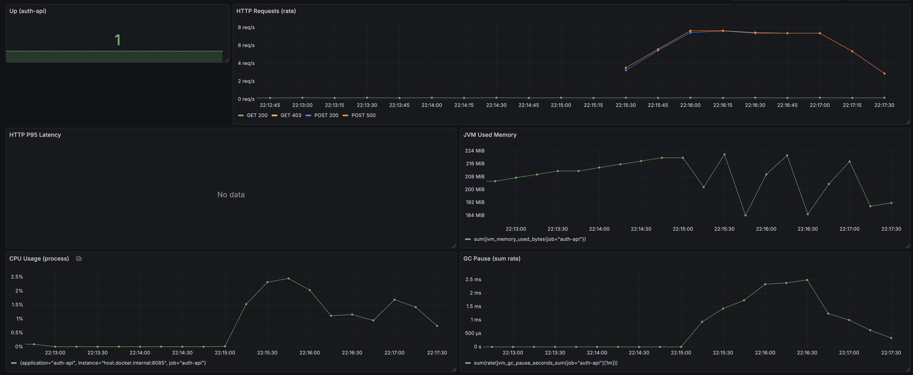

# Auth API 부하 테스트 결과 보고서 (템플릿)

## 개요
- 테스트 대상: auth-api
- 측정 일시:
- 테스트 환경:
  - 서버 스펙:
  - DB/Redis 설정:
  - 네트워크/호스트:
- 테스트 도구: k6
- Grafana 대시보드 캡처: 아래 각 시나리오에 직접 첨부

---

## 1) Baseline (정상 트래픽)
- 목표: 경량 부하에서 지연/에러 안정성 확인
- 실행 커맨드:
```
# 예시
k6 run load-test/auth-api-basic.js -e BASE_URL=http://localhost:8085 --vus 10 --duration 2m
```
- 핵심 결과 요약:
  - 평균 RPS:
  - p50 / p95 응답시간:
  - 에러율:
  - 리소스 사용(평균 CPU/메모리):
- 특이사항:
- 지표
  

---

## 2) Stress (점진적 증가)
- 목표: 성능 저하/에러 증가 지점 확인
- 실행 커맨드:
```
# 예시
k6 run load-test/auth-api-basic.js -e BASE_URL=http://localhost:8085 \
  --stage 1m:10 --stage 3m:50 --stage 2m:100 --stage 1m:0
```
- 핵심 결과 요약:
  - 최대 안정 처리량(RPS):
  - 성능 저하 시작 지점:
  - p95 응답시간 변화:
  - 에러율 변화:
  - 리소스 사용(최대 CPU/메모리):
- 특이사항:
- 지표

---

## 3) Spike (급격한 버스트)
- 목표: 급격한 트래픽 증가 시 회복력 확인
- 실행 커맨드:
```
# 예시
k6 run load-test/auth-api-basic.js -e BASE_URL=http://localhost:8085 \
  --stage 30s:5 --stage 30s:80 --stage 1m:5
```
- 핵심 결과 요약:
  - 스파이크 구간 p95 응답시간:
  - 에러율 스파이크 여부:
  - 회복 시간:
- 특이사항:
- 지표


---

## 4) Endurance (지속 부하)
- 목표: 메모리 누수/성능 저하 추세 확인
- 실행 커맨드:
```
# 예시
k6 run load-test/auth-api-basic.js -e BASE_URL=http://localhost:8085 --vus 20 --duration 15m
```
- 핵심 결과 요약:
  - 시간 경과에 따른 응답시간 변화:
  - 메모리/GC 추세:
  - 에러율 추세:
- 특이사항:
- 지표

---

## 종합 결론
- 안정 처리량 추정:
- 병목 후보:
- 개선 제안:
